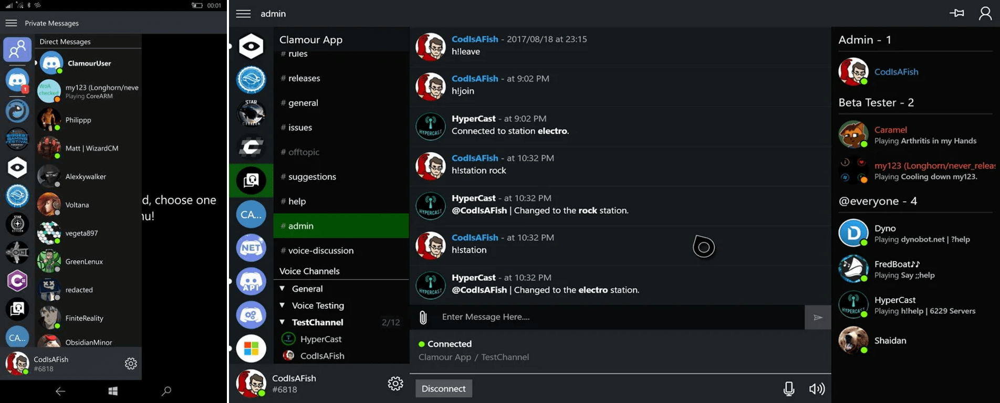

# UWP Community Projects

An awesome list of UWP community projects

Announcement : [UWP Community — Launch 2019](https://medium.com/@Arlodottxt/launch-2019-7efd37cc0877)

## Apps

- Multimedia
	* [File explorers](#file-explorers)
	* [Audio players](#audio-players)
	* [Video players](#video-players)
	* [Image viewers](#image-viewers)
	* [Notes](#notes)

- Communication
	* [Discord](#discord)
	* [devRant](#devrant)
	* [Reddit](#reddit)
	* [Facebook](#facebook)

- Social
	* [Entertainment](#entertainment)

- Financial
	* [Cryptocurrencies](#cryptocurrencies)

- IoT
	* [Philips Hue](#philips-hue)

- Utilities
	* [Network](#network)

- Misc
	* [Journal](#journal)
	
### Multimedia

#### File explorers

| &nbsp; | PC  | Mobile | Xbox | 1-click install | Ad-free | Free | In-app free | Open source |
|:------ |:---:|:------:|:----:|:---------------:|:-------:|:----:|:-----------:|:-----------:|
| Files UWP | ✔ | ? | ? | * | ? | ? | ? | ✔

* Files UWP — More than just a rewrite of Windows Explorer

\* *Join the private beta on UWP Community Discord, contact `Yair#3380`*

#### Audio players

| &nbsp; | PC  | Mobile | Xbox | 1-click install | Ad-free | Free | In-app free | Open source |
|:------ |:---:|:------:|:----:|:---------------:|:-------:|:----:|:-----------:|:-----------:|
| Bread Player | ✔ | ✔ | ? | ✔ | ? | ✘ | ? | ✔

* Bread Player — Sleek & polish designed alternative to Groove and WMP

#### Video players

| &nbsp; | PC  | Mobile | Xbox | 1-click install | Ad-free | Free | In-app free | Open source |
|:------ |:---:|:------:|:----:|:---------------:|:-------:|:----:|:-----------:|:-----------:|
| Cafeine | ✔ | ✔ | ? | ✔ | ? | ? | ? | ✔

* Cafeine — Media library integrated with multiple online services in one UWP app

#### Image viewers

| &nbsp; | PC  | Mobile | Xbox | 1-click install | Ad-free | Free | In-app free | Open source |
|:------ |:---:|:------:|:----:|:---------------:|:-------:|:----:|:-----------:|:-----------:|
| Image Preview | ✔ | ? | ? | ✔ | ? | ? | ? | ✘

* Image Preview

#### Notes

| &nbsp; | PC  | Mobile | Xbox | 1-click install | Ad-free | Free | In-app free | Open source |
|:------ |:---:|:------:|:----:|:---------------:|:-------:|:----:|:-----------:|:-----------:|
| Easy Writer | ✔ | ? | ? | ✔ | ? | ? | ? | ✘

* Easy Writer — distraction free writing with Markdown

### Communication

#### Discord

| &nbsp; | PC  | Mobile | Xbox | 1-click install | Ad-free | Free | In-app free | Open source |
|:------ |:---:|:------:|:----:|:---------------:|:-------:|:----:|:-----------:|:-----------:|
| Clamour | ✘ | ? | ? | ✔ | ? | ✔ | ? | ✘
| Quarrel | ? | ? | ? | ✔ | ? | ✔ | ? | ✘

* Clamour

#### devRant

| &nbsp; | PC  | Mobile | Xbox | 1-click install | Ad-free | Free | In-app free | Open source |
|:------ |:---:|:------:|:----:|:---------------:|:-------:|:----:|:-----------:|:-----------:|
| devRant UWP | ✔ | ✔ | ✔ | ✔ | ? | ✔ | ? | ✘

* devRant UWP

#### Reddit

| &nbsp; | PC  | Mobile | Xbox | 1-click install | Ad-free | Free | In-app free | Open source |
|:------ |:---:|:------:|:----:|:---------------:|:-------:|:----:|:-----------:|:-----------:|
| Legere | ✔ | ? | ? | ✔ | ✘ | ✔ | ✘ | ✘

* Legere

#### Facebook

| &nbsp; | PC  | Mobile | Xbox | 1-click install | Ad-free | Free | In-app free | Open source |
|:------ |:---:|:------:|:----:|:---------------:|:-------:|:----:|:-----------:|:-----------:|
| LightSocial | ✔ | ✔ | ? | ✔ | ? | * | ✘ | ✘

* LightSocial

*[Contribute by providing a PC screenshot]*

\* *Pro version released [separately](https://www.microsoft.com/store/apps/9nblggh4ztbl)*

### Social

#### Entertainment

| &nbsp; | PC  | Mobile | Xbox | 1-click install | Ad-free | Free | In-app free | Open source |  
|:------ |:---:|:------:|:----:|:---------------:|:-------:|:----:|:-----------:|:-----------:|
| Bandsaround Concerts | ? | ? | ? | ✔ | ? | ✘ | ? | ?

* Bandsaround Concerts — An unofficial Bandsintown application

### Financial

#### Cryptocurrencies

| &nbsp; | PC  | Mobile | Xbox | 1-click install | Ad-free | Free | In-app free | Open source |  
|:------ |:---:|:------:|:----:|:---------------:|:-------:|:----:|:-----------:|:-----------:|
| CryptoTracker | ✔ | ✔ | ✔ | ✔ | ✔ | ✔ | ? | ✔

* CryptoTracker — Simple yet powerful cryptocurrency tracker for Windows 10

### IoT

#### Philips Hue

| &nbsp; | PC  | Mobile | Xbox | 1-click install | Ad-free | Free | In-app free | Open source |  
|:------ |:---:|:------:|:----:|:---------------:|:-------:|:----:|:-----------:|:-----------:|
| Huetro for Hue | ✔ | ✔ | ✔ | ✔ | ? | ✔ | ? | ✔

### Utility

#### Network

| &nbsp; | PC  | Mobile | Xbox | 1-click install | Ad-free | Free | In-app free | Open source |  
|:------ |:---:|:------:|:----:|:---------------:|:-------:|:----:|:-----------:|:-----------:|
| Littledot | ✔ | ? | ? | ✔ | ? | ✔ | ? | ?

* Littledot — simplified DNS over TLS for Windows 10

### Misc

#### Journal

| &nbsp; | PC  | Mobile | Xbox | 1-click install | Ad-free | Free | In-app free | Open source |  
|:------ |:---:|:------:|:----:|:---------------:|:-------:|:----:|:-----------:|:-----------:|
| Bullet Journal Touch | ? | ? | ? | ✔ | ? | ✔ | ✘ | ?
| Diarium | ✔ | ✔ | ? | ✔ | ? | ✘ | ? | ?

* Bullet Journal Touch — Keep yourself to account and build a visual tracker of just about anything

* Diarium — Keep all your precious memories in one place and remind you to write down your experiences

---

## TODO

* Finish sorting (progress : 15/42, 27 left)
* Add apps websites + button icon
* Make contribution guidelines
* Add new apps
* Add per-domain comparison tables & make contribution guide

---

### Kanban Ink
Kanban for Windows 10, with an Ink Whiteboard

[Store](https://www.microsoft.com/store/apps/9P5RSNPRQRMD?cid=Launch2019)

### MALClient
[Store](https://www.microsoft.com/en-us/store/p/malclient/9nblggh5f3bl)

### Mixplay for Mixer
[Store](https://www.microsoft.com/en-us/store/p/mixplay-for-mixer/9pn94d9bdfzm)

### MyTube
The highly praised YouTube client

[Store](https://www.microsoft.com/en-us/p/mytube-beta/9wzdncrdt29j)

### Nightingale
A fast and resource-efficient REST API client.

[Store](https://www.microsoft.com/en-us/p/nightingale-rest-api-client/9n2t6f9f5zdn)

### OneLocker
[Store](https://www.microsoft.com/en-us/store/p/onelocker-password-manager/9nblggh3t7g3)

### Pillbox
[Store](https://www.microsoft.com/en-us/store/p/pillbox/9nblggh4x7vb)

### Podcasted
[Store](https://www.microsoft.com/en-us/store/p/podcasted/9nxwgr2b1p26)

### Prayer Assistant
[Store](https://www.microsoft.com/en-us/store/p/prayer-assistant-a-catholic-prayer-companion/9mvb8tqccdj4)

### Private Files
File locker for Windows 10 with Windows Hello security 

[Store](https://www.microsoft.com/store/apps/9N3V10GH7XTC?cid=uwpcommunitydiscord) 

### Quarrel
A frequently updated Discord client for all Windows devices
[Store](https://www.microsoft.com/en-us/p/quarrel/9nbrwj777c8r)
[GitHub](https://github.com/Avid29/Quarrel)

### Quick Pad
Quick Pad - UWP Notepad
[Store](https://www.microsoft.com/en-us/p/quick-pad-uwp-notepad/9pdlwqhtlsv3)
[GitHub](https://github.com/yaichenbaum/Quick-Pad)

### Roamit
[Store](https://www.microsoft.com/en-us/store/p/roamit/9nrdffns92g1)

### Savidraw
[Store](https://www.microsoft.com/en-us/store/p/savidraw/9wzdncrdnkvb)

### Spotimo
A groove-inspired, fully featured Spotify client

[Store](https://www.microsoft.com/en-us/p/spotimo-beta/9p75w183m6qr)

### Stack 10
Stackoverflow client
[Store](https://www.microsoft.com/en-us/p/stack-10/9nblggh5361b)

### SoundByte
[Store](https://www.microsoft.com/en-us/store/p/soundbyte-music-player/9nblggh4xbjg)

### UniversalSoundBoard
[Store](https://www.microsoft.com/store/apps/9NBLGGH51005)

### Uno Platform
Uno Platform - The UWP Bridge for iOS, Android and WebAssembly
[GitHub](https://github.com/nventive/Uno)

### Unstream
[Store](https://www.microsoft.com/en-us/store/p/unstream/9wzdncrcwb0g)

### Uwp Companion
Redirect various websites to a preferred third party UWP app

[Store](https://chrome.google.com/webstore/detail/uwp-companion-beta/egfgdliklfgpmdjfofbmhmoejdhehani)
[GitHub](https://github.com/Arlodotexe/UWP-Companion)

### Voyer
UWP 4chan client for Windows 10 and Windows 10 Mobile.

[Store](https://www.microsoft.com/store/apps/9MW7JNFM85FL?cid=uwpcommunitydiscord)

### Winsta
An Instagram Universal Experience
[Store](https://www.microsoft.com/en-us/p/winsta-an-instagram-universal-experience/9pnzdjkxnqvk)

### Xpotify
A third-party modern Spotify experience built for Windows 10
[Store](https://www.microsoft.com/en-us/p/xpotify-a-modern-spotify-experience-for-windows-10/9n1n68mc7fxr)

### XYZ Anime Player EX
[Store](https://www.microsoft.com/en-us/store/p/xyz-anime-player-ex/9nblggh6d375)

### Year in Pixels
A Year based Pixel diary app 

[Store](https://www.microsoft.com/store/apps/9PN9BC89FCM0?cid=uwpcommunitydiscord) 

### Youtube App Launcher
[Github](https://github.com/colinkiama/Youtube-App-Launcher-UWP)

### Title
Description client

[Store](url)
[Github](url)